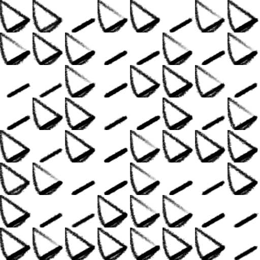
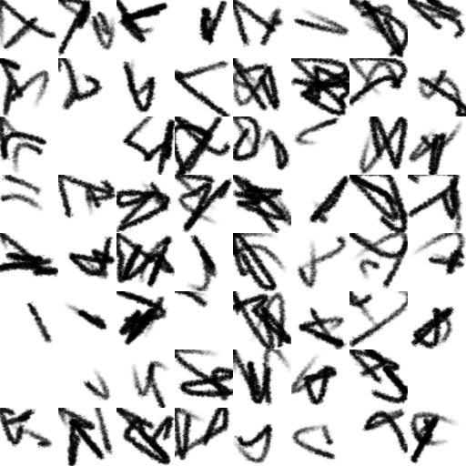

# SPIRAL in TensorFlow (in progress)

TensorFlow implementation of [Synthesizing Programs for Images using Reinforced Adversarial Learning](https://deepmind.com/blog/learning-to-generate-images/) (**SPIRAL**).

**SPIRAL** is an adversarially trained agent that generates a program which is executed by a graphics engine to interpret and sample images. This agent is trained to fool a discriminator with a distributed reinforcement learning without any supervision.

In short, Distributed RL + GAN + Program synthesis.

## Prerequisites

- *Python 2.7*
- [MyPaint 1.2.x](https://github.com/mypaint/mypaint/tree/v1.2.x)
- [TensorFlow 1.6.0](http://pytorch.org/)

## Usage

Install prerequisites with:

    ./install.sh
    pip install -r requirements.txt

To debug a **SPIARL** model:

    python run.py --num_workers 8 --env simple --episode_length=1 \
                  --location_size=8 --conditional=True \
                  --loss=l2 --policy_batch_size=1

To train a **SPIARL** model:

    python run.py --num_workers 16 --env simple_mnist --episode_length=3 \
                  --color_channel=1 --location_size=32 --loss=gan --num_gpu=1 \
                  --disc_dim=8 --conditional=False \
                  --mnist_nums=1,7 --jump=False --curve=False

    python run.py --num_workers 24 --env simple_mnist --episode_length=6 \
                  --color_channel=1 --location_size=32 --loss=gan --num_gpu=2 \
                  --disc_dim=64 --conditional=False \
                  --mnist_nums=0,1,2,3,4,5,6,7,8,9 --jump=True

    python run.py --num_workers 12 --env simple_mnist --episode_length=2 \
                  --color_channel=1 --location_size=32 --conditional=True \
                  --mnist_nums=1 --loss=gan

    python run.py --num_workers 24 --env simple_mnist --episode_length=3 \
                  --color_channel=1 --location_size=32 --conditional=True \
                  --mnist_nums=1,2,7 --loss=l2

    python run.py --num_workers 24 --env simple_mnist --episode_length=3 \
                  --color_channel=1 --location_size=32 --conditional=True \
                  --mnist_nums=1,2,7 --loss=gan --num_gpu=2

    python run.py --num_workers 24 --env simple_mnist --episode_length=5 \
                  --color_channel=1 --location_size=32 --conditional=True \
                  --mnist_nums=0,1,2,7 --loss=gan --num_gpu=2

## Results

(in progress)

Random generated samples at early stage:

Incorrectly converged samples at early stage:

Tensorboard:

## To-do

- [x] IMPALA A2C
- [ ] IMPALA V-trace
- [x] Simple environment (debugging)
- [x] Find a correct libmypaint setting
- [x] MNIST environment
- [x] ReplayThread (`--loss=gan`)
- [x] `--num_gpu=2` test
- [x] `--conditional=True` (need more details)
- [ ] Replay memory needs more detailed information
- [ ] Population Based Training (to be honest, I don't have any plan for this)

## References

*This code is heavily based on [openai/universe-starter-agent](https://github.com/openai/universe-starter-agent).*

- [Population Based Training of Neural Networks](https://arxiv.org/abs/1711.09846)
- [Asynchronous Methods for Deep Reinforcement Learning](https://arxiv.org/abs/1602.01783)
- [IMPALA: Scalable Distributed Deep-RL with Importance Weighted Actor-Learner Architectures](https://arxiv.org/abs/1802.01561)

## Author

Taehoon Kim / [@carpedm20](http://carpedm20.github.io/)
